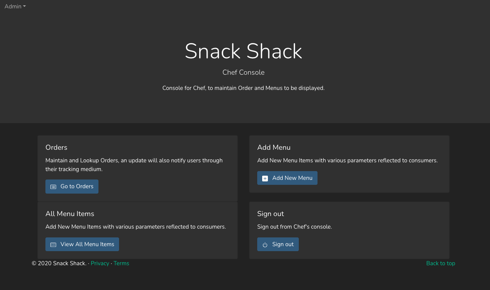
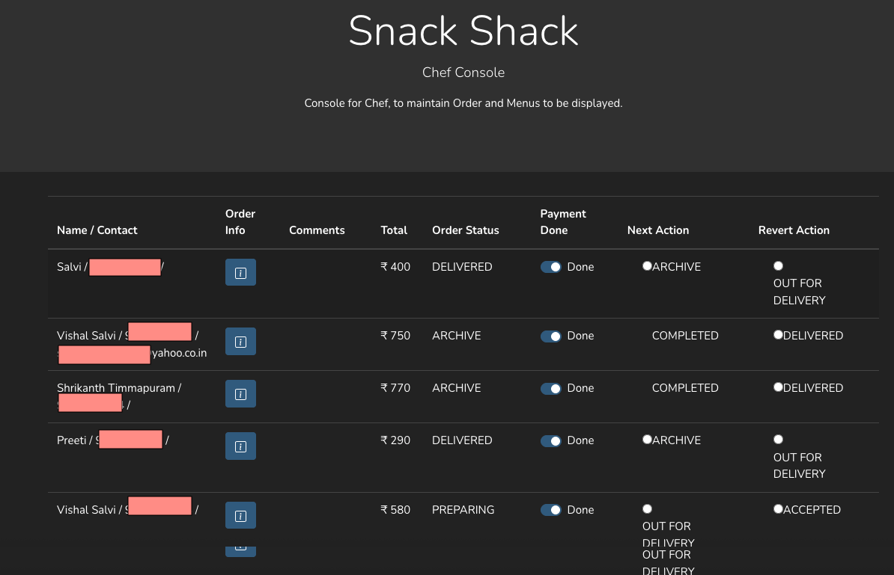
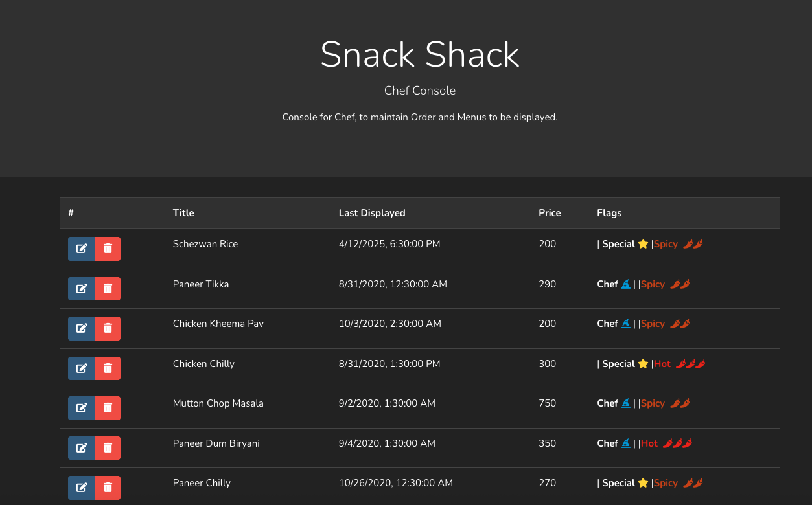
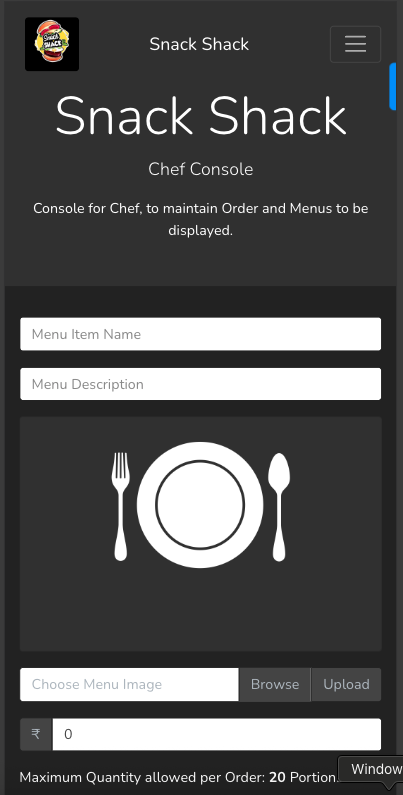

# Chef Console Documentation

The Chef Console is the administrative interface of the Snack Shack application, designed for restaurant staff to manage orders and menu items efficiently. This documentation provides an overview of the main features and functionalities available in the Chef Console.

## Table of Contents
1. [Dashboard Overview](#dashboard-overview)
2. [Orders Management](#orders-management)
3. [Menu Items Management](#menu-items-management)
4. [Adding New Menu Items](#adding-new-menu-items)

## Dashboard Overview

The Chef Console dashboard provides quick access to all essential functions needed to manage the restaurant's operations.

Key features accessible from the dashboard:
- Orders management
- Menu items management
- Add new menu items
- Quick sign out option

## Orders Management

The Orders section allows staff to view and manage all incoming orders in real-time.

Features:
- Real-time order updates
- Order status management
- Customer information
- Order details and specifications
- Notification system for new orders

## Menu Items Management

View and manage all menu items currently available in your restaurant.

Capabilities:
- Complete list of all menu items
- Quick edit options
- Status updates (available/unavailable)
- Price and portion management
- Menu item details

## Adding New Menu Items

The Add Menu feature provides an intuitive interface for adding new items to your menu.

Form fields include:
- Menu Item Name
- Description
- Image upload
- Price setting
- Maximum quantity per order
- Availability toggle

### Key Features:
1. **Image Upload**: 
   - Support for high-quality images
   - Image preview before upload
   - Multiple image format support

2. **Menu Item Details**:
   - Detailed description field
   - Price configuration
   - Portion size settings

3. **Order Limits**:
   - Set maximum quantity per order
   - Availability management
   - Stock control options

## Best Practices

1. **Image Guidelines**:
   - Use high-quality images
   - Maintain consistent image dimensions
   - Optimize images for web display

2. **Menu Item Description**:
   - Be clear and concise
   - Include allergen information
   - Mention special preparations if any

3. **Pricing Strategy**:
   - Set competitive prices
   - Consider portion sizes
   - Account for preparation costs

## Security

The Chef Console is protected by authentication and authorization mechanisms:
- Secure login required
- Role-based access control
- Session management
- Automatic timeout for security
