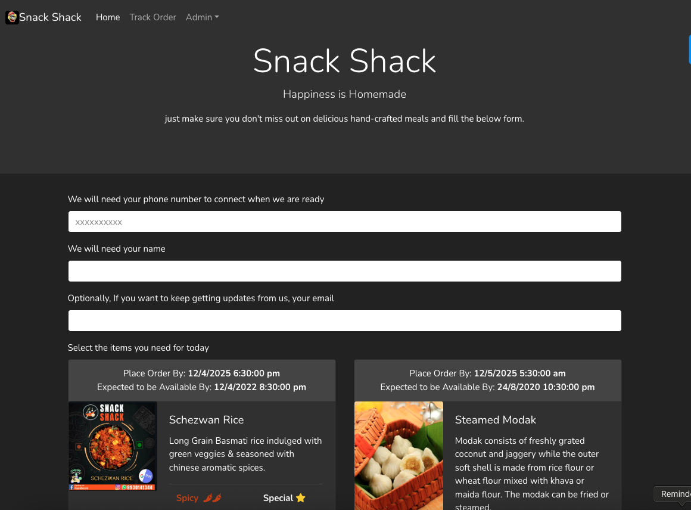
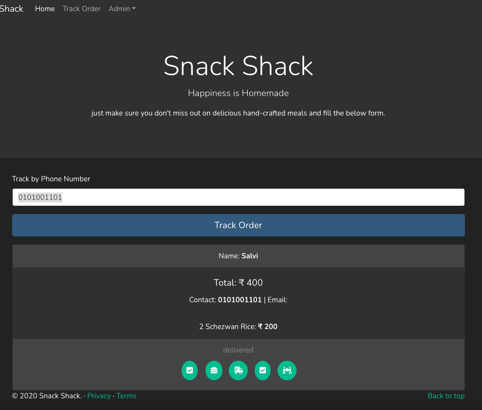

# Snack Shack - User Guide

Welcome to Snack Shack! This guide will help you navigate through our food ordering system and make the most of your experience.

## Table of Contents
1. [Home Page](#home-page)
2. [Placing an Order](#placing-an-order)
3. [Tracking Your Order](#tracking-your-order)

## Home Page

The home page is your gateway to delicious hand-crafted meals at Snack Shack.

### Key Features:

1. **Menu Display**:
   - Browse through available menu items
   - View detailed descriptions
   - See preparation times
   - Check special tags (Spicy 🌶️, Special ⭐)

2. **Order Information**:
   - Place Order By: Shows when you need to place your order
   - Expected Availability: Indicates when your food will be ready

3. **Menu Item Details**:
   - High-quality images of each dish
   - Detailed descriptions
   - Spice levels indicated
   - Special markings for featured items

### How to Place an Order:

1. Fill in your contact details:
   - Phone number (required)
   - Name (required)
   - Email (optional) for updates and promotions

2. Select your items:
   - Browse through the available menu
   - Read descriptions and check preparation times
   - Note any special indicators (spicy, special items)

## Tracking Your Order

Stay updated with your order status through our easy-to-use tracking system.

### Tracking Features:

1. **Order Status Indicators**:
   - Order Received ✉️
   - Order Confirmed 📋
   - In Preparation 🚗
   - Ready for Pickup ✔️
   - Delivered 🤝

2. **Order Details**:
   - Order summary
   - Total amount
   - Contact information
   - Individual item details

### How to Track Your Order:

1. Click on "Track Order" in the navigation menu
2. Enter your phone number
3. View real-time status updates
4. Check estimated delivery/pickup time

## Tips for the Best Experience

1. **Ordering Best Practices**:
   - Place orders within the specified timeframe
   - Double-check your contact information
   - Review your order before submission
   - Note the expected availability time

2. **Order Tracking**:
   - Save your order tracking number
   - Keep your phone handy for updates
   - Check the status regularly

3. **Special Requests**:
   - Note any dietary restrictions
   - Mention special instructions when placing the order